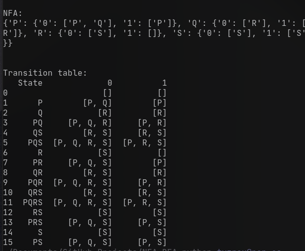
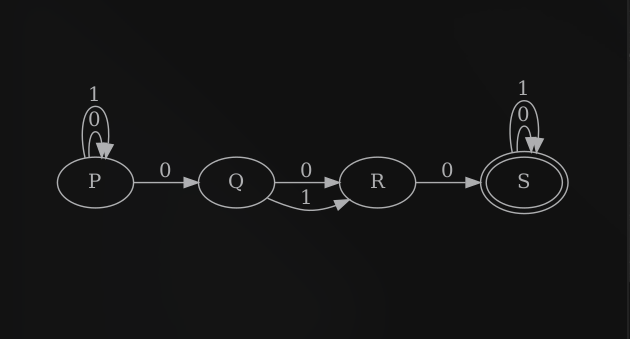
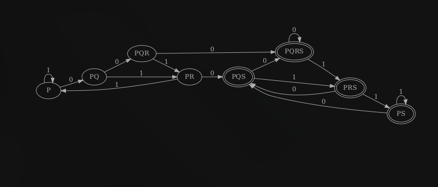

## Sample Inputs and Outputs

Here we will see how the inputs are given and how the outputs are recieved by the program.

## Input Sample:

* The program takes the input in the following order

  ```bash
  Enter the number of states in the NFA: 4
  Enter the states separated by space: P Q R S
  Enter the number of symbols in the NFA: 2
  Enter the symbols separated by space: 0 1

  Enter the start state in the NFA: P
  Enter the final states separated by space: S

  Enter the state: P

  Enter the path: 0
  Enter end state from state A travelling through path a : 
  P Q

  Enter the path: 1
  Enter end state from state A travelling through path b : 
  P

  Enter the state: Q

  Enter the path: 0
  Enter end state from state B travelling through path a : 
  R

  Enter the path: 1
  Enter end state from state B travelling through path b : 
  R

  Enter the state: R

  Enter the path: 0
  Enter end state from state C travelling through path a : 
  S

  Enter the path: 1
  Enter end state from state C travelling through path b : 
  0

  Enter the state: S

  Enter the path: 0
  Enter end state from state C travelling through path a : 
  S

  Enter the path: 1
  Enter end state from state C travelling through path b : 
  S
  ```

## Sample Output:

We can receive the following outputs. Outputs from this program are of three types. First one is the output we get in the terminal which consists of the transition table and NFA in a list which can be shown below



The second output is the entered NFA which is shown below:



And the third output is the converted DFA which is also shown below:



This is how we can get a visual representation of the NFA and converted DFA for an easier understanding.

---
